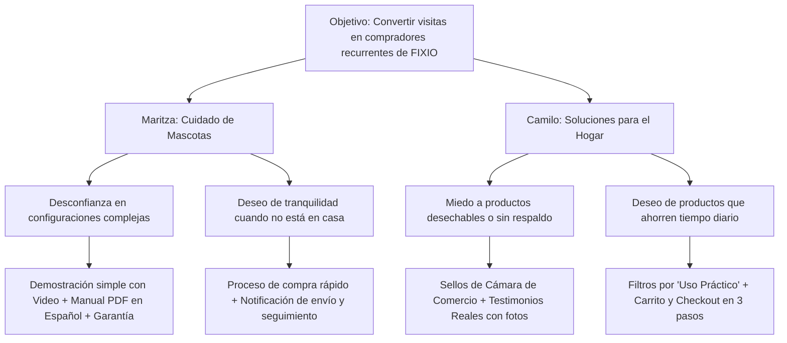

# Trigger Map: Fixio Solutions E-Commerce

## 1. Objetivos de Negocio (Business Goals)

| ID | Objetivo | Métrica / KPI | Impacto Deseado |
|---|---|---|---|
| **BG1** | Posicionar a FIXIO como la marca preferida de productos prácticos para el hogar en Bogotá | Tasa de conversión > 3.5% | Reconocimiento y ventas recurrentes |
| **BG2** | Venta y adopción del Alimentador Inteligente IMIPAW y catálogo inicial | 100+ unidades en el primer trimestre | Retorno de inversión en inventario |
| **BG3** | Generar confianza y lealtad en compradores de clase media (estratos 3-4) | Calificación promedio > 4.7★ | Recomendación boca a boca y testimonios |

---

## 2. Personas Clave y Psicología del Usuario

### Persona 1: Maritza — "La Dueña de Mascota Ocupada"
* **Perfil:** 34 años, profesional en Bogotá, vive con su gato y trabaja en horario extenso.
* **Fuerzas Impulsoras Positivas (Deseos):** Quiere que su gato coma a horas exactas, mantenerlo sano y no preocuparse si se retrasa en el tráfico o el trabajo.
* **Fuerzas Impulsoras Negativas (Fricciones/Miedos):** Miedo a comederos complicados que pierdan señal de Wi-Fi, desconfianza en métodos de pago o demoras en la entrega.
* **Detonante de Compra:** Descubrir un alimentador con App programable, garantía local y entrega rápida con opción de pago contra entrega o PSE/Nequi.

### Persona 2: Camilo — "El Buscador de Soluciones Prácticas"
* **Perfil:** 29 años, vive solo o en pareja, le gusta la tecnología que ahorra tiempo sin costar una fortuna.
* **Fuerzas Impulsoras Positivas (Deseos):** Automatizar tareas del hogar (cocina, orden, mascotas), comprar productos garantizados con precio justo.
* **Fuerzas Impulsoras Negativas (Fricciones/Miedos):** Miedo a comprar productos "desechables" o manuales confusos de importación.
* **Detonante de Compra:** Explicación clara de beneficios en español, video demostrativo de uso y respaldo de empresa legalmente constituida (FIXIO SOLUTIONS SAS).

---

## 3. Diagrama de Mapa de Efectos (Effect Map)

