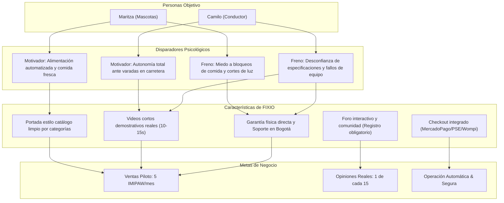

# Trigger Map: FIXIO

Este mapa conecta los objetivos comerciales de FIXIO con los disparadores psicológicos (motivadores y frenos) de nuestros usuarios objetivo, sirviendo de base para todas las decisiones de experiencia de usuario (UX), diseño visual y desarrollo de software.

---

## 1. Objetivos del Negocio (Business Goals)

* **Meta de Negocio 1 (Comercial):** Vender mínimo 5 comederos IMIPAW al mes durante los primeros 3 meses de lanzamiento (Piloto de validación comercial).
* **Meta de Negocio 2 (Comunidad):** Lograr una tasa de conversión de opiniones del 6.7% (1 de cada 15 compradores) para generar prueba social en la web.
* **Meta de Negocio 3 (Operativa):** Procesar el 100% de transacciones de forma segura y automática mediante checkout local (MercadoPago/Wompi/PSE) con entregas en Bogotá en menos de 48 horas.

---

## 2. Portal y Soluciones (Product Hub)

**FIXIO E-commerce:** Portal responsivo mobile-first con portada clásica de catálogo organizado por categorías (Mascotas, Conectividad, Hogar Inteligente, Carro), potenciado con videos de demostración cortos, foro de soporte y un flujo de compra exclusivo para usuarios registrados.

---

## 3. Grupos Objetivo y Personas (Target Groups)

| Prioridad | Grupo Objetivo | Persona Representativa | Rol / Perfil Relacionado |
| :--- | :--- | :--- | :--- |
| **1. Principal** | Dueño de Mascotas Ocupado | [Maritza la Madrugadora](personas/maritza-madrugadora.md) | Profesional de Bogotá (estratos 3-4) que pasa todo el día fuera de casa. |
| **2. Secundario** | Conductor Urbano | [Camilo el Conductor](personas/camilo-conductor.md) | Persona que conduce diariamente en Bogotá y busca autonomía ante varadas. |
| **3. Terciario** | Viajero Frecuente / Social | [Valeria la Viajera](personas/valeria-viajera.md) | Persona independiente que viaja los fines de semana o llega tarde a casa. |

---

## 4. Fuerzas Impulsoras (Driving Forces)

### [Maritza la Madrugadora](personas/maritza-madrugadora.md) (Dueña de Mascotas)

* **Motivadores (Qué busca - ✅):**
  1. **Alimentación automática programada:** Asegurar que su gato reciba comida a horas fijas sin esfuerzo manual diario.
  2. **Control de porciones exactas:** Evitar que su mascota coma todo de golpe y sufra indigestión o sobrepeso.
  3. **Frescura garantizada:** Mantener el alimento seco crujiente y hermético, lejos de insectos y del aire.
  4. **Seguimiento desde el celular:** Confirmar mediante notificaciones históricas que la mascota comió.
* **Frenos (Qué teme - ❌):**
  1. **Bloqueo del dispensador:** Miedo a que la comida se atasque y su gato pase hambre todo el día.
  2. **Apagón o caída de Wi-Fi:** Temor a que un corte eléctrico desactive el comedero (requiere batería de respaldo).
  3. **Sabotaje del animal:** Miedo a que el gato tumbe el aparato o abra la tapa por la fuerza.
  4. **Complejidad técnica de red:** Temor a no saber configurar la red 2.4GHz en su celular.

### [Camilo el Conductor](personas/camilo-conductor.md) (Conductor Urbano)

* **Motivadores (Qué busca - ✅):**
  1. **Autonomía vial absoluta:** Resolver pinchazos o baterías muertas por sí mismo en menos de 10 minutos.
  2. **Portabilidad de herramientas:** Equipos compactos que quepan en la guantera y se carguen mediante USB Tipo C.
  3. **Simplicidad operativa:** Conectar y usar inmediatamente con un solo botón, sin procesos complejos.
  4. **Tranquilidad en ruta:** Conducir relajado sabiendo que lleva soluciones portátiles seguras.
* **Frenos (Qué teme - ❌):**
  1. **Autodescarga en baúl:** Miedo a que el iniciador esté descargado al momento de una emergencia.
  2. **Materiales de baja calidad:** Temor a pinzas cortas o plásticos frágiles que se rompan en uso.
  3. **Sobrecalentamiento del inflador:** Temor a que el motor del inflador se queme a mitad del proceso.
  4. **Datos técnicos falsos:** Desconfianza en las especificaciones infladas de amperaje comunes en internet.

---

## 5. Priorización Estratégica (Strategic Ranking)

Para optimizar recursos en el diseño (Freya) y desarrollo (Mimir), se priorizarán las interacciones en el siguiente orden:

1. **Flujo de Registro y Compra Segura:** El registro y login obligatorio no debe entorpecer la conversión; el proceso debe ser extremadamente limpio en móvil y conectarse fluido a MercadoPago/PSE.
2. **Mitigación del Freno de Configuración (IMIPAW):** La web debe destacar en video y soporte en Bogotá cómo emparejar de forma sencilla la red de 2.4GHz.
3. **Videos de Demostración Emocional:** Dar prioridad visual a los videos de acción real (iniciador prendiendo un motor apagado, comedero dispensando) en las páginas de producto.
4. **Foro y Preguntas Frecuentes:** Facilitar la creación de temas técnicos educativos por categoría para disipar dudas (ej. diferencias USB, presión de llantas).

---

## 6. Diagrama de Conexiones Psicológicas

El siguiente diagrama ilustra cómo las características clave de FIXIO abordan de forma directa los motivadores y frenos de nuestros usuarios para lograr las metas del negocio:

---

**Creado por:** Saga (Analista Estratégica WDS)
**Última Actualización:** 2026-06-15
